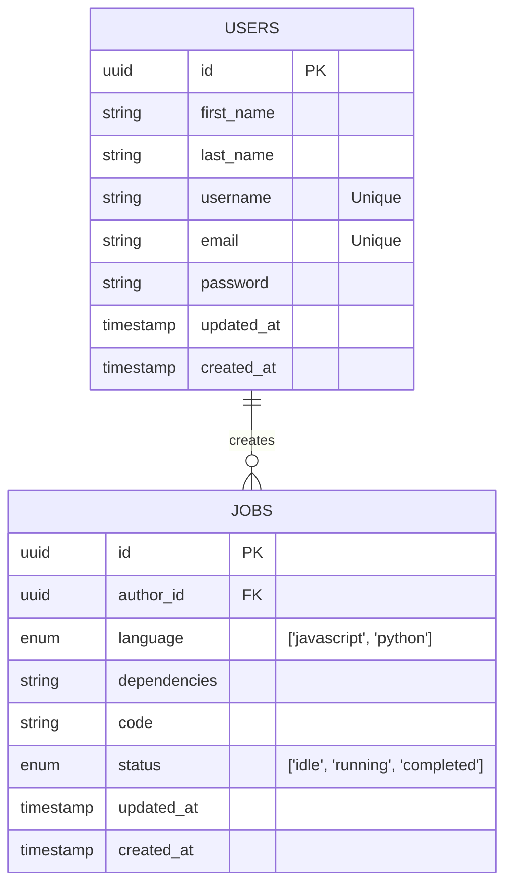

# Job-Queue
Software that completes user jobs using workers.

# Architecture

client --> API server --> database <-- worker service

The client makes a request regarding a job. The database is updated and the API sends its response. The worker service updates its jobs queue, assigns it to workers, and marks the job as completed in the database.

## Database

