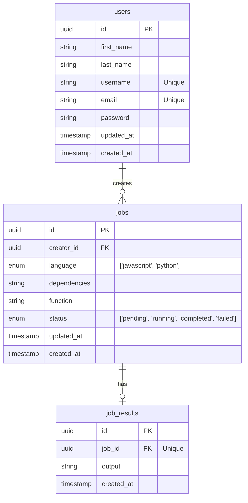

# Job-Queue

An application that executes user jobs on an external server.

# Architecture

client --> API server --> database <-- worker service

The client makes a request regarding a job. The database is updated and the API sends its response. The worker service updates its jobs queue, assigns it to workers, and marks the job as completed in the database.

## Database

# Problem

Users want to minimize the utilisation of their machine to provide a more responsive experience to their end-users. But, system bottleneck analysis is costly and cumbersome for users and they would rather an alternative that is easier to implement and less expensive.

## How This Application Offers A Solution

This application tackles the problem by offering users a way to delegate jobs to an external machine through an API and later receive the result of its execution.
